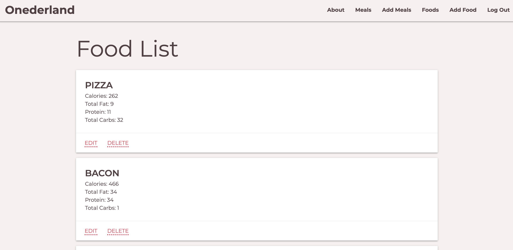

Website Title: Onederland

Track progress toward your nutrition, and weight loss goals with Onederland. This all-in-one food tracker and health app is like having a nutrition coach, meal planner, and food diary with you at all times. This is a health app to help you learn about your habits, see how you eat,  make smarter food choices, find motivation & support, and conquer your health goals.

Wireframe and UI:
Home Page:

Add meals page:

Foods Page:

About Page:

Meals Page:

Technologies used:  Python, Bootstrap, Django, Postgresql

Future fearture:
- We would like a pie char in our home page to have an eye pelasing visual for the user.
- We want the users stats to accumulate over a week
- We want to add photos of food
- We want to build a "recipe" with foods so I can save meals I eat regularly
- We want to add "workout" to recalculate daily calories.
- We want the user to be able to set a daily calorie goal
- We want to share foods/meals/recipes